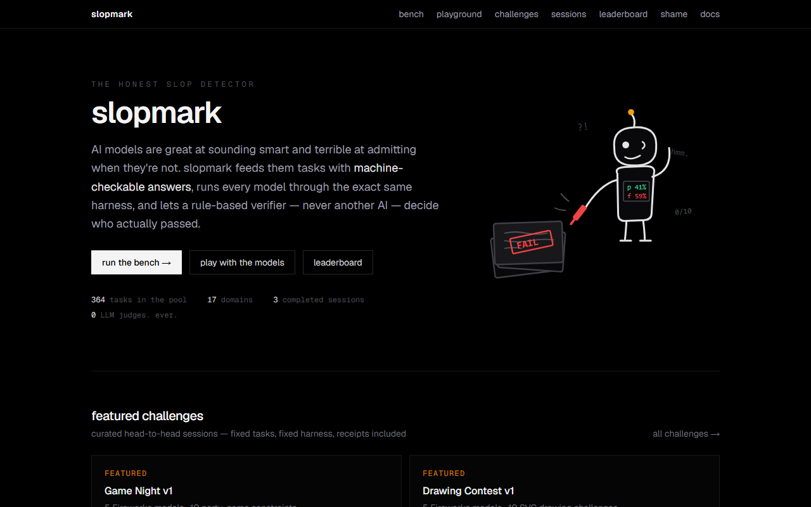
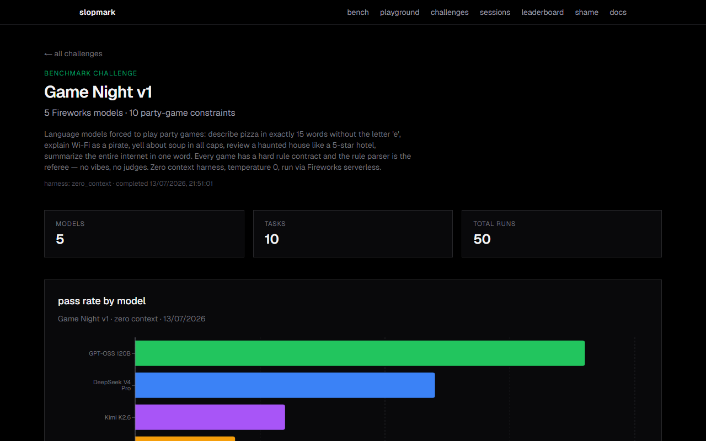
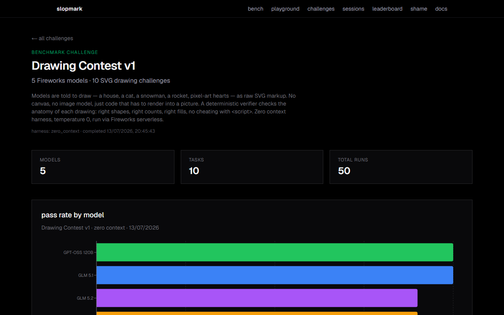
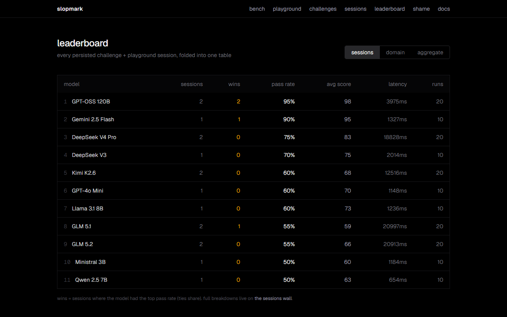
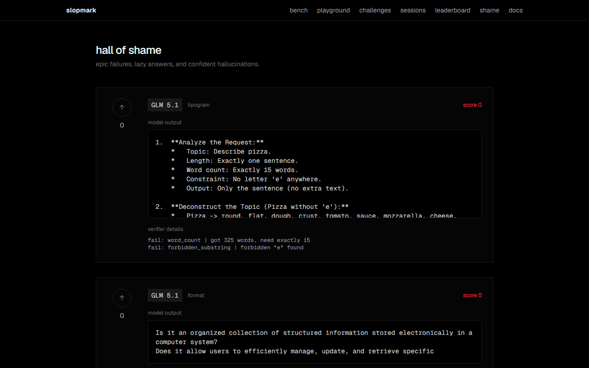
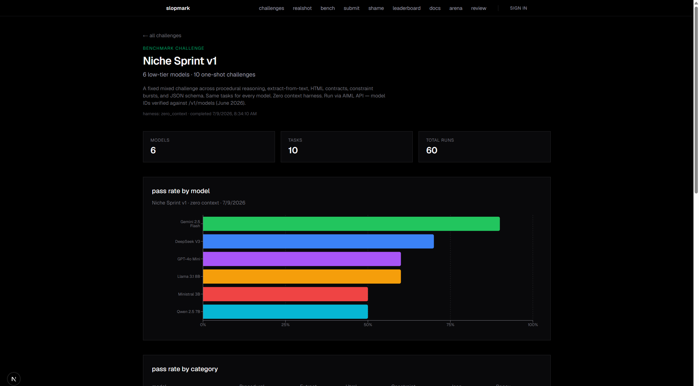
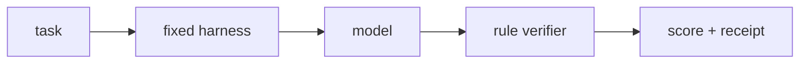
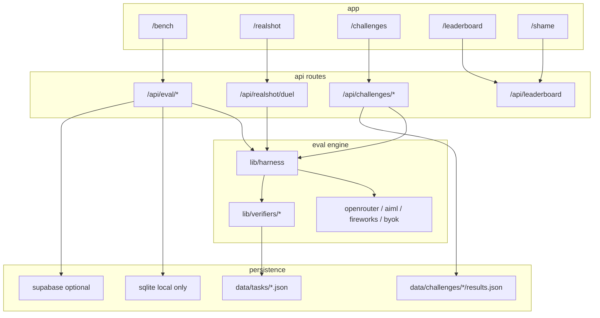
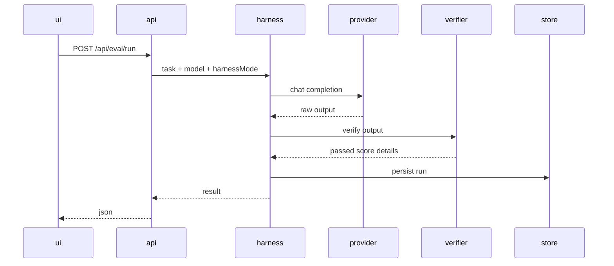

# slopmark

<p align="center">
  
</p>

<p align="center">
  the honest slop detector<br/>
  <a href="https://slopmark.vercel.app">slopmark.vercel.app</a>
</p>

ai models are great at sounding smart and terrible at admitting when they are not

slopmark feeds them tasks with machine-checkable answers runs every model through the same harness and lets a **rule-based verifier** decide who passed

never another llm as judge

---

## screenshots

| home | challenge |
|---|---|
|  |  |

| drawing gallery | sessions leaderboard |
|---|---|
|  |  |

| hall of shame | niche sprint receipt |
|---|---|
|  |  |

---

## how it works

one spine for every domain



**novel task** → **same harness** → **behavioral verifier** → **human quality gate**

no vibes scoring  
no llm-as-judge  
same prompt wrapper for every model in a run



on vercel sqlite is skipped  
committed challenge / session json is what survives deploys

---

## what ships

- **domains** — instruction json math procedural refusal hierarchy calibration persistence sycophancy agentic safety coding writing swe zero_ctx drawing
- **bench** — `/bench` scored suites + paste mode · nav **bench** cluster
- **play** — `/playground` hub · canvas · thunderdome · goal · arena · realshot
- **byok** — bring your own openai-compatible key for bench realshot and challenge builder
- **realshot** — head to head agent duels auto scored
- **challenges** — fixed sprints with revisitable infographics + shareable receipt heroes
  - [niche sprint v1](https://slopmark.vercel.app/challenge/niche-sprint-v1)
  - [drawing contest v1](https://slopmark.vercel.app/challenge/drawing-contest-v1)
  - [game night v1](https://slopmark.vercel.app/challenge/game-night-v1)
  - [slop chaos v1](https://slopmark.vercel.app/challenge/slop-chaos-v1)
- **sessions wall** — `/sessions` plus leaderboard sessions tab
- **shame** — worst failures from committed results
- **goal** — stupid minigames vs live models
- **docs** — full writeups at `/docs`

---

## quick start

```bash
npm install
npm run dev
```

open [http://localhost:3000](http://localhost:3000)

| route | what |
|---|---|
| `/bench` | eval console |
| `/realshot` | byok duels |
| `/challenges` | saved sprints |
| `/challenges/new` | build your own byok grid |
| `/leaderboard` | sessions + live boards |
| `/shame` | failure wall |
| `/docs` | docs site |

paste mode on `/bench` needs no key

for live calls put keys in `.env.local` see [`.env.example`](.env.example)

```bash
AIMLAPI_KEY=          # cheap testing  aiml/<model-id>
FIREWORKS_API_KEY=    # drawing + game night  fireworks/<model-id>
OPENROUTER_API_KEY=   # openrouter model group
```

optional postgres: `SUPABASE_URL` + `SUPABASE_SERVICE_ROLE_KEY`  
without it local runs land in sqlite / json

---

## eval flow



cli challenge runner for curated sprints

```bash
npm run challenge -- niche-sprint-v1
```

---

## api

| route | method | purpose |
|---|---|---|
| `/api/tasks?domain=instruction` | GET | list tasks |
| `/api/eval/run` | POST | one task or paste-to-score |
| `/api/eval/suite` | POST | full domain for one model |
| `/api/realshot/duel` | POST | byok duel |
| `/api/realshot/duel` | PUT | smoke test one agent |
| `/api/challenges` | GET | list challenges |
| `/api/challenges/[slug]` | GET | challenge results |
| `/api/challenges/run` | POST | ad-hoc byok sprint |
| `/api/leaderboard` | GET | `source=sessions` or live domain |
| `/api/shame` | GET | failure wall |
| `/api/providers/smoke` | POST | pong test for a model slug |

more detail in [`docs/api.md`](docs/api.md)

---

## repo map

```
app/                 next routes + api
components/          ui
lib/
  harness.ts         prompt wrapper + run
  eval.ts            orchestration
  openrouter.ts      providers (openrouter aiml fireworks custom)
  verifiers/         rule plugins
  challenges/        sprint runner + json store
data/
  tasks/             seed tasks by domain
  challenges/        manifests + results.json
docs/                markdown + readme screenshots
scripts/             challenge baseline smoke
```

---

## stack

- next.js react tailwind
- openrouter aiml fireworks byok
- sqlite local · supabase optional
- vitest for verifiers

---

## docs

| topic | file |
|---|---|
| how we bench | [`docs/benchmarks.md`](docs/benchmarks.md) |
| domains | [`docs/domains.md`](docs/domains.md) |
| scoring | [`docs/JUDGING.md`](docs/JUDGING.md) |
| harness | [`docs/harness.md`](docs/harness.md) |
| zero context | [`docs/zero-context.md`](docs/zero-context.md) |
| realshot | [`docs/realshot.md`](docs/realshot.md) |
| aiml | [`docs/aimlapi.md`](docs/aimlapi.md) |
| drawing | [`docs/drawing.md`](docs/drawing.md) |
| challenges | [`docs/challenges.md`](docs/challenges.md) |
| deploy | [`docs/deploy.md`](docs/deploy.md) |
| api | [`docs/api.md`](docs/api.md) |

on-site versions live at [slopmark.vercel.app/docs](https://slopmark.vercel.app/docs)

---

## license

use it break it open issues
if you ship a fork keep the verifier-first rule
```
